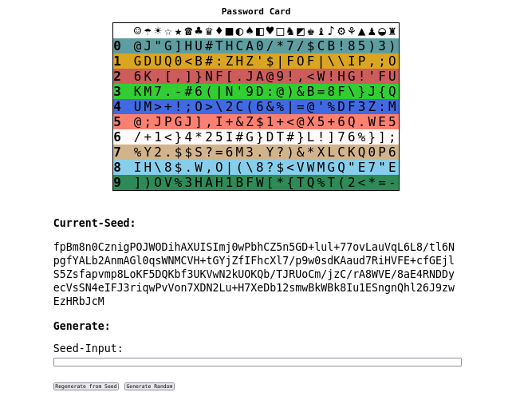

[](https://shields.io/)

# Password Card

An client-side generated password card via a web browser. Inspired by https://www.passwordcard.org/en.

## Getting Started

### Online

You can access the current version of the source code at passwordcard.dviererbe.de. The files are served via [Cloudflare Pages](https://pages.cloudflare.com/).

### Locally

1. Download the source code
```sh
    git clone https://github.com/dviererbe/PasswordCard.git && cd ./PasswordCard
```

2. (optional) Verify Signature
```sh
    # import my pgp keys from keybase.io
    curl https://keybase.io/dviererbe/pgp_keys.asc | gpg --import
    
    # let git verify the most recent commit
    git verify-commit HEAD
```

3. Open `src/index.html` in the Browser
```sh
    firefox ./src/index.html
```

**Note**: If you want to use this on [tails](https://tails.boum.org/index.en.html) you have to copy the files in the `/home/amnesia/Tor Browser` folder to access it via the [Tor Browser](https://www.torproject.org/).

## Motivation

I created this project because i wanted to use password cards on an [air gapped](https://en.wikipedia.org/wiki/Air_gap_%28networking%29) PC. Solutions like https://www.passwordcard.org/en generate the card on the server and transmit it via the internet. Although the transmission is encrypted via TLS and passwordcard.org is most likely an service that can be trusted, it is in my eyes an security bad practice.

With this solution i can generate and store the password card without ever needing a connection to the internet or trust a thrid party to don't log my password card seed, which reduces the attack surface. 

## Screenshot



## LICENSE
The source code is licensed under the GNU General Public License Version 3 or higher versions.   
The [DejaVu Mono](https://dejavu-fonts.github.io/) Font is licensed under a custom [free license](./src/fonts/DejaVu%20Mono/LICENSE). 

More information about the the GPLv3 license:
* https://www.gnu.org/licenses/gpl-3.0-standalone.html
* https://opensource.org/licenses/GPL-3.0
* https://choosealicense.com/licenses/gpl-3.0/